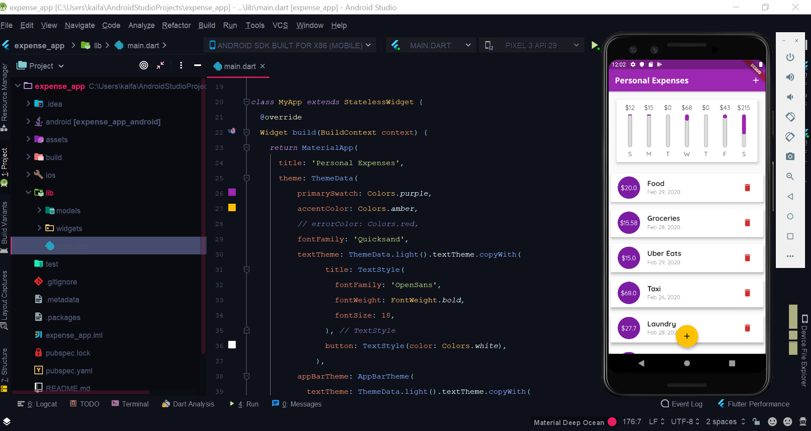

# Expense_App

A Flutter application to track and visualise daily expenses

# Functionality

The homepage displays list of transactions made throughout the calendar year and a chart to visualise the expenses of the past week. 

Basic steps of adding an expense:
 1. Click raised add button or navbar 'add' icon
 2. Enter description and amount
 3. Choose a date 
 
 
 
 ## Youtube Video:
 
 
 
